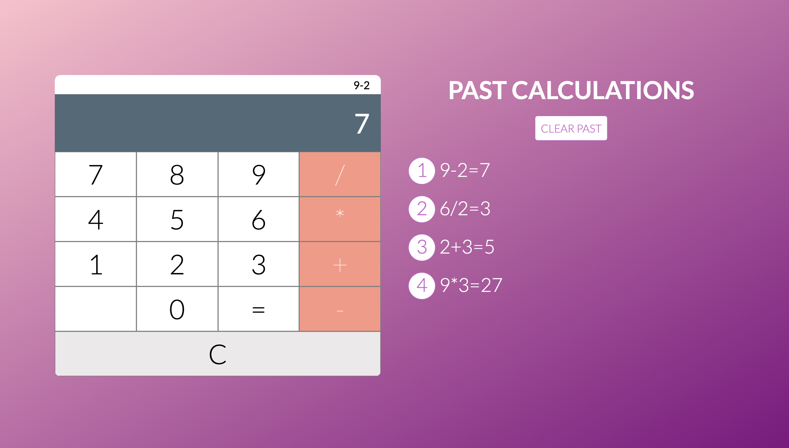

# Sezzle Calculator Challenge

## Hosted On: https://sezzlecalctl.herokuapp.com/

### Description
Basic calculator that allows users to make live calculations and share it across anyone connected. Calculations are saved to a user's local storage.

### Technologies
* HTML/CSS
* React (Hooks + Context API)
* Express/Node.js
* Socket.IO 


### Installing
1. Cd into desired project directory.
2. Clone this repo.
3. Install dependencies
```npm install.```
4. Start the client and server
```npm run dev.```
5. Open http://localhost:3000 in browser.
*Note - to test real-time calculations locally, change the url in client/src/socket.js to http://localhost:5000

### Preview 




